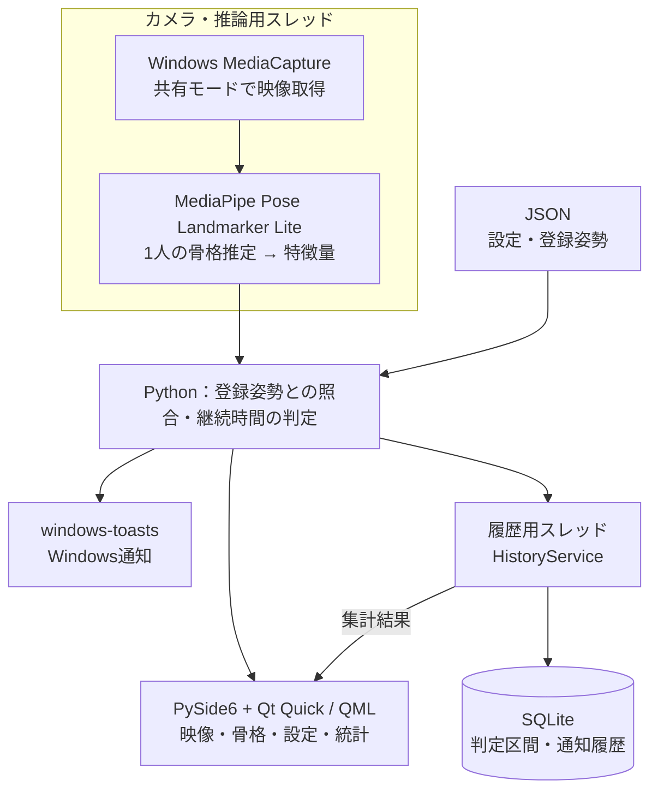
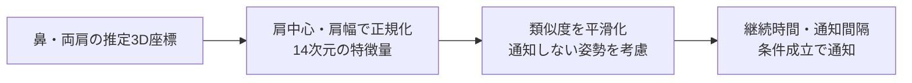
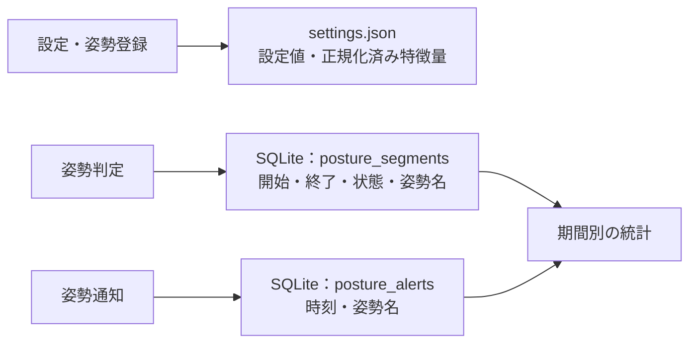

# PoseCare 技術概要

**PCカメラで登録した姿勢を検知し、続いたときだけ通知するWindows常駐アプリ。** 姿勢の推定・照合・履歴の集計はPC内で完結します。

## 1. 仕様

| 項目 | 動作 |
| --- | --- |
| 対象 | Windows 10 / 11（64 bit）、Webカメラ、1人の上半身。ソース実行はPython 3.12 |
| 登録 | 悪い姿勢／通知しない姿勢を複数登録。約3秒静止し、特徴量の中央値を保存 |
| 通知 | 同じ悪い姿勢が初期値4秒続くとWindows通知。同じ登録姿勢への通知間隔は初期値5分（変更可） |
| 再通知 | 良い姿勢・通知しない姿勢が8秒続くと待機時間を解除。ウィンドウを閉じて常駐へ移る際も解除 |
| 常駐 | 閉じる・最小化でトレイへ。ロック中、または人の不在とPC操作なしがともに5分続くとカメラを解放し、復帰時に再接続 |
| 統計 | 1日・7日・30日の良い姿勢の割合、監視時間、悪い姿勢別の時間、通知回数 |

ここでの「良い姿勢」は、登録した悪い姿勢に該当しない状態です。医学的な正しさを判定するものではなく、未検出・停止中は割合の分母に含めません。

## 2. 技術構成

| 技術 | この構成で使う理由 |
| --- | --- |
| Python + NumPy | 姿勢推定APIと特徴量処理をまとめ、映像の配列処理も扱える |
| MediaCapture（SharedReadOnly） | カメラを排他的に占有せず、他のWindows機能との共存を図る |
| PySide6 + QML | Pythonの処理と宣言的な画面を接続し、トレイ常駐も実装できる |
| スレッド分離 | カメラ・推論とSQLite処理をGUIスレッドから分け、画面操作を止めにくくする |
| PyInstaller + Inno Setup | Python環境を別途用意せずに使えるEXE・インストーラーとして配布する |

GitHub Actionsでテスト・ビルド・Release公開を行い、アプリ内更新では更新ZIPのSHA-256を照合します。

## 3. なぜUltralytics YOLOではなくMediaPipeか

**決め手は、頭の前後位置や肩の奥行き差に使う推定3D座標を、そのまま取得できることです。** 以下は現実装の要件との対応であり、両者の速度・精度を比較測定した結果ではありません。

| 観点 | 採用：MediaPipe Pose Landmarker Lite | 比較：Ultralytics YOLO Poseの標準人体モデル |
| --- | --- | --- |
| 出力 | 33点の骨格と推定3Dワールド座標 | COCO形式の17点、2D座標と信頼度 |
| 今回の判定 | 鼻・両肩のx・y・zを直接特徴量にできる | 同じ3D特徴量で判定するには、別途奥行き推定などが必要 |
| 組み込み | 学習済みLiteモデル＋動画モードを利用 | 2Dの姿勢照合は可能だが、現在の判定方式の変更が必要 |

点の多さ自体が採用理由ではありません。実際の照合には**鼻・左肩・右肩の3点**だけを使います。単眼カメラの3D座標は推定値で、実測の奥行きではありません。

特徴量は相対座標9成分＋頭・肩の指標5成分です。登録時はモデルを追加学習せず、その代表値を保存します。照合時は重み付き距離を類似度に変換し、通知しない姿勢が悪い姿勢と同程度以上に近ければ通知対象から外します。検出できないフレームでは継続判定をリセットします。

公式仕様：[MediaPipe Pose Landmarker](https://developers.google.com/edge/mediapipe/solutions/vision/pose_landmarker) / [Ultralytics Pose](https://docs.ultralytics.com/tasks/pose/)

## 4. なぜSQLiteか・何を保存するか

**1台のPCで完結する履歴管理なので、DBサーバーを必要とせず、期間検索できるSQLiteを採用しています。** 少量の設定はJSON、増え続ける時系列履歴はSQLiteに分けています（[SQLiteの用途](https://www.sqlite.org/whentouse.html)）。

- **保存量を抑える：** 毎フレームの座標ではなく、判定が続いた区間を記録。時刻の索引で対象期間を検索し、Pythonで時間・割合を集計します。
- **保存先と保持期間：** `%LOCALAPPDATA%\PoseCare`。履歴は400日を超えた分を自動削除します。
- **データの扱い：** 映像・元の骨格座標は保存せず、姿勢データをクラウドへ送信しません。モデルの初回取得と更新確認・取得には通信します。

実装：[カメラ・推論](../pose_care/camera.py) / [特徴量・判定](../pose_care/posture.py) / [設定](../pose_care/config.py) / [履歴](../pose_care/history.py) / [履歴の非同期処理](../pose_care/history_service.py)

[READMEへ戻る](../README.md)
